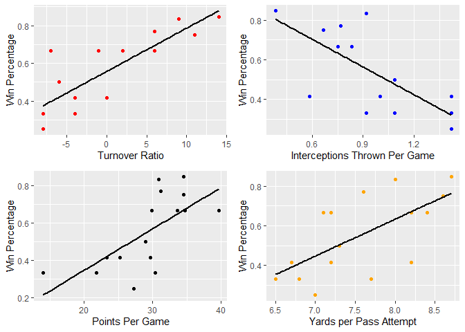
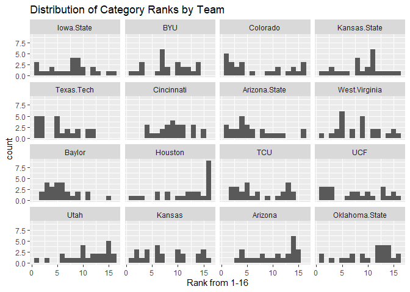
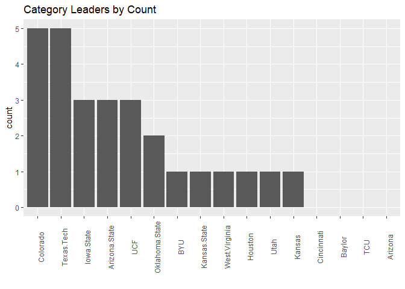

Final Draft
================
Blake Behrens
2024-11-04

# Proposal:

In this project, we will look at team statistics from Big 12 Football
teams. We will look at what variable correlate most with win percentage,
analyze which teams are best in which categories, and see which teams
are most efficient.

### Data Collection

The first thing we must do is create a Data Set for each of the Big 12
Football Teams. To do this, I will use a technique called ‘webscraping’,
where I access each team’s website on ESPN and pull the important data
from the website’s HTML:

``` r
urls = c('https://www.espn.com/college-football/team/stats/_/type/team/id/66',
         'https://www.espn.com/college-football/team/stats/_/type/team/id/252',
         'https://www.espn.com/college-football/team/stats/_/type/team/id/38',
         'https://www.espn.com/college-football/team/stats/_/type/team/id/2306',
         'https://www.espn.com/college-football/team/stats/_/type/team/id/2641',
         'https://www.espn.com/college-football/team/stats/_/type/team/id/2132',
         'https://www.espn.com/college-football/team/stats/_/type/team/id/9',
         'https://www.espn.com/college-football/team/stats/_/type/team/id/277',
         'https://www.espn.com/college-football/team/stats/_/type/team/id/239',
         'https://www.espn.com/college-football/team/stats/_/type/team/id/248',
         'https://www.espn.com/college-football/team/stats/_/type/team/id/2628',
         'https://www.espn.com/college-football/team/stats/_/type/team/id/2116',
         'https://www.espn.com/college-football/team/stats/_/type/team/id/254',
         'https://www.espn.com/college-football/team/stats/_/type/team/id/2305',
         'https://www.espn.com/college-football/team/stats/_/type/team/id/12',
         'https://www.espn.com/college-football/team/stats/_/type/team/id/197')
ids = c('Iowa State','BYU','Colorado','Kansas State','Texas Tech','Cincinnati','Arizona State','West Virginia','Baylor','Houston','TCU','UCF','Utah','Kansas','Arizona','Oklahoma State')
length(ids) == length(urls)
```

    ## [1] TRUE

This code segment identifies the ESPN link to each team’s team
statistics. Then, I give an `id` to each link to identify which team it
belongs to, and check that the length of both variables is the same<br>

Now, lets write a base case for one url:

``` r
site = read_html(urls[1])
tbl = site %>% html_nodes(".Table__TD") %>% html_text()
df = data.frame("Category" = tbl[1:50], "Stat" = tbl[51:100])
df$team = ids[1]
head(df)
```

    ##                Category Stat       team
    ## 1 Total Points Per Game 31.2 Iowa State
    ## 2          Total Points  405 Iowa State
    ## 3      Total Touchdowns   49 Iowa State
    ## 4             1st Downs      Iowa State
    ## 5       Total 1st downs  293 Iowa State
    ## 6     Rushing 1st downs  112 Iowa State

``` r
str(df)
```

    ## 'data.frame':    50 obs. of  3 variables:
    ##  $ Category: chr  "Total Points Per Game" "Total Points" "Total Touchdowns" "1st Downs" ...
    ##  $ Stat    : chr  "31.2" "405" "49" "" ...
    ##  $ team    : chr  "Iowa State" "Iowa State" "Iowa State" "Iowa State" ...

Now we can see that this is the data we want to see for `Iowa State`,
lets apply it to each team and create a larger data frame with each
team’s information:

``` r
i=1
large.df = data.frame()
for(url in urls){
  #Access url's html
  site = read_html(url)
  #Scrape wanted data
  tbl = site %>% html_nodes(".Table__TD") %>% html_text()
  record = site %>% html_nodes(".ml4 li:nth-child(1)") %>% html_text()
  #organize into data frame
  df = data.frame("Category" = tbl[1:50], "Stat" = tbl[51:100])
  #label data, and increase iteration
  df$Team = ids[i]
  df$record = record
  i = i +1
  #combine small with large dataset
  large.df = rbind(large.df,df)
}
```

We now have our large dataset that we desired, but its not formatted
very well. The first thing we want to do is remove rows where the
category is a description, and not a statistic. We can find these rows
easily because they do not have a value in the `Stat` column.

``` r
df = large.df %>% 
  filter(Stat != '')
head(df)
```

    ##                Category Stat       Team record
    ## 1 Total Points Per Game 31.2 Iowa State   10-3
    ## 2          Total Points  405 Iowa State   10-3
    ## 3      Total Touchdowns   49 Iowa State   10-3
    ## 4       Total 1st downs  293 Iowa State   10-3
    ## 5     Rushing 1st downs  112 Iowa State   10-3
    ## 6     Passing 1st downs  151 Iowa State   10-3

Next, I want to make each team have a row, with each statistic being a
column. Its also important to rename some categories so their names do
not begin with a number

``` r
df = df %>% 
  pivot_wider(names_from = Category, values_from = Stat)
colnames(df)[9:13] = c('first downs by penalty','third down efficiency','third down percentage','fourth down efficiency','fourth down percentage')
head(df)
```

    ## # A tibble: 6 × 43
    ##   Team         record `Total Points Per Game` `Total Points` `Total Touchdowns`
    ##   <chr>        <chr>  <chr>                   <chr>          <chr>             
    ## 1 Iowa State   10-3   31.2                    405            49                
    ## 2 BYU          10-2   30.9                    371            44                
    ## 3 Colorado     9-3    34.5                    414            54                
    ## 4 Kansas State 8-4    29.9                    359            44                
    ## 5 Texas Tech   8-4    38.6                    463            57                
    ## 6 Cincinnati   5-7    25.2                    302            37                
    ## # ℹ 38 more variables: `Total 1st downs` <chr>, `Rushing 1st downs` <chr>,
    ## #   `Passing 1st downs` <chr>, `first downs by penalty` <chr>,
    ## #   `third down efficiency` <chr>, `third down percentage` <chr>,
    ## #   `fourth down efficiency` <chr>, `fourth down percentage` <chr>,
    ## #   `Comp-Att` <chr>, `Net Passing Yards` <chr>,
    ## #   `Yards Per Pass Attempt` <chr>, `Net Passing Yards Per Game` <chr>,
    ## #   `Passing Touchdowns` <chr>, Interceptions <chr>, …

``` r
str(df)
```

    ## tibble [16 × 43] (S3: tbl_df/tbl/data.frame)
    ##  $ Team                        : chr [1:16] "Iowa State" "BYU" "Colorado" "Kansas State" ...
    ##  $ record                      : chr [1:16] "10-3" "10-2" "9-3" "8-4" ...
    ##  $ Total Points Per Game       : chr [1:16] "31.2" "30.9" "34.5" "29.9" ...
    ##  $ Total Points                : chr [1:16] "405" "371" "414" "359" ...
    ##  $ Total Touchdowns            : chr [1:16] "49" "44" "54" "44" ...
    ##  $ Total 1st downs             : chr [1:16] "293" "267" "256" "241" ...
    ##  $ Rushing 1st downs           : chr [1:16] "112" "116" "61" "120" ...
    ##  $ Passing 1st downs           : chr [1:16] "151" "133" "166" "110" ...
    ##  $ first downs by penalty      : chr [1:16] "30" "18" "29" "11" ...
    ##  $ third down efficiency       : chr [1:16] "79-186" "49-139" "62-150" "61-154" ...
    ##  $ third down percentage       : chr [1:16] "42.47" "35.25" "41.33" "39.61" ...
    ##  $ fourth down efficiency      : chr [1:16] "17-21" "18-24" "8-20" "14-25" ...
    ##  $ fourth down percentage      : chr [1:16] "80.95" "75.00" "40.00" "56.00" ...
    ##  $ Comp-Att                    : chr [1:16] "255-437" "205-356" "337-459" "207-353" ...
    ##  $ Net Passing Yards           : chr [1:16] "3,310" "2,856" "3,926" "2,553" ...
    ##  $ Yards Per Pass Attempt      : chr [1:16] "7.6" "8.0" "8.6" "7.2" ...
    ##  $ Net Passing Yards Per Game  : chr [1:16] "254.6" "238.0" "327.2" "212.8" ...
    ##  $ Passing Touchdowns          : chr [1:16] "22" "21" "35" "22" ...
    ##  $ Interceptions               : chr [1:16] "10" "11" "8" "9" ...
    ##  $ Sacks-Yards Lost            : chr [1:16] "15--77" "16--85" "39--313" "11--101" ...
    ##  $ Rushing Attempts            : chr [1:16] "485" "415" "322" "419" ...
    ##  $ Rushing Yards               : chr [1:16] "2,102" "1,913" "845" "2,454" ...
    ##  $ Yards Per Rush Attempt      : chr [1:16] "4.3" "4.6" "2.6" "5.9" ...
    ##  $ Rushing Yards Per Game      : chr [1:16] "161.7" "159.4" "70.4" "204.5" ...
    ##  $ Rushing Touchdowns          : chr [1:16] "24" "17" "15" "18" ...
    ##  $ Total Offensive Plays       : chr [1:16] "937" "787" "820" "783" ...
    ##  $ Total Yards                 : chr [1:16] "5,412" "4,769" "4,771" "5,007" ...
    ##  $ Yards Per Game              : chr [1:16] "416.3" "397.4" "397.6" "417.3" ...
    ##  $ Kickoffs: Total             : chr [1:16] "9-181" "20-531" "15-314" "26-509" ...
    ##  $ Average Kickoff Return Yards: chr [1:16] "20.1" "26.6" "20.9" "19.6" ...
    ##  $ Punt: Total                 : chr [1:16] "14-237" "13-124" "17-197" "13-158" ...
    ##  $ Average Punt Return Yards   : chr [1:16] "16.4" "9.5" "11.6" "12.2" ...
    ##  $ INT: Total                  : chr [1:16] "14-97" "20-113" "12-217" "9-156" ...
    ##  $ Average Interception Yards  : chr [1:16] "6.9" "5.7" "18.1" "17.3" ...
    ##  $ Net Average Punt Yards      : chr [1:16] "37.0" "39.5" "37.7" "37.5" ...
    ##  $ Punt: Total Yards           : chr [1:16] "51-2,168" "37-1,548" "49-2,145" "43-1,804" ...
    ##  $ FG: Good-Attempts           : chr [1:16] "21-28" "21-24" "12-15" "16-20" ...
    ##  $ Touchback Percentage        : chr [1:16] "53" "53" "20" "63" ...
    ##  $ Total-Yards                 : chr [1:16] "51-362" "57-481" "92-817" "66-547" ...
    ##  $ Avg. Per Game (YDS)         : chr [1:16] "27" "40" "68" "45" ...
    ##  $ Possession Time Seconds     : chr [1:16] "32:18" "30:55" "28:13" "28:59" ...
    ##  $ Fumbles-Lost                : chr [1:16] "10-5" "15-7" "13-5" "13-6" ...
    ##  $ Turnover Ratio              : chr [1:16] "6" "9" "11" "-1" ...

### Questions to Be Answered: 

Now that we have a dataset, what questions do we want to answer:

1.  What variables correlate best with winning percentage?
2.  What are different ways to measure offensive efficiency?
3.  Who are the most efficient offensive teams in the Big 12?
4.  Which team is best in each Statistical Category?<br>

### More Organization

Before we can answer those questions, lets do some further organization
of our data.<br> First, we want to make sure all columns are formatted
as single numbers, not combinations. Meaning, columns like
`Sacks - Yards lost` should be turned into multiple columns, `Sacks` and
`Yards Lost`<br>

``` r
df = df %>% 
  separate(`third down efficiency`, '-', 
           into = c('third.converted','third.attempted') ) %>% 
  separate(`fourth down efficiency`, '-', 
           into = c('fourth.converted','fourth.attempted') ) %>% 
  separate(`Comp-Att`, '-', 
           into = c('completions','pass.attempts') ) %>% 
  separate(`Sacks-Yards Lost`, '--', 
           into = c('sacks.lost','yds.lost.sacks') ) %>% 
  separate(`Kickoffs: Total`, '-', 
           into = c('kickoffs.returned','kickoff.yards.returned') ) %>% 
  separate(`Punt: Total`, '-', 
           into = c('punts.returned','punt.yards.returned') ) %>% 
  separate(`INT: Total`, '-', 
           into = c('interceptions','int.yards.returned') ) %>% 
  separate(`Punt: Total Yards`, '-', 
           into = c('punts','punt.yards') ) %>% 
  separate(`FG: Good-Attempts`, '-', 
           into = c('FG.made','fg.attempts') ) %>% 
  separate(`Total-Yards`, '-', 
           into = c('penalties.against','penalized.yards') ) %>% 
  separate(`Fumbles-Lost`, '-', 
           into = c('fumbles','fumbles.lost') ) %>% 
  separate(record, '-',
             into = c('wins','losses')) %>% 
  mutate(t.o.p = (as.numeric(substr(`Possession Time Seconds`,1,2)) * 60) + as.numeric(substr(`Possession Time Seconds`,4,5)))
```

Now, before we go any further, since each column, other than `Team`, is
numeric we must covert them to be a numeric data type. In order to do
that, we must also re-format the column names so there is no whitespace.
Furthermore, remove any commas from numbers that are in the thousands

``` r
new.names = gsub(' ','.', colnames(df))
colnames(df) = new.names
#Remove any commas in the entire data frame
df[] <- lapply(df, function(x) gsub(",", "", as.character(x)))

#Make columns 2:n numeric
for (col in colnames(df)[2:ncol(df)]){
  df[[col]] = as.numeric(df[[col]])
}
```

    ## Warning: NAs introduced by coercion

Our data is now accessible as numeric values, so lets look at which
columns we will be interested in. We must also add `games` as the sum of
`wins` and `losses`. Additionally, we summarize some statistics like
`completion.rate` instead of total `completions`.

``` r
df = df %>% 
  mutate(games = wins + losses) %>% 
  select(Team, wins, losses, games, Total.Points.Per.Game,
         Total.Touchdowns,Total.1st.downs,Rushing.1st.downs,Passing.1st.downs,
         first.downs.by.penalty,third.down.percentage,fourth.down.percentage,
         completions,pass.attempts,Yards.Per.Pass.Attempt,Passing.Touchdowns,
         Interceptions,sacks.lost,yds.lost.sacks,Yards.Per.Rush.Attempt,
         Rushing.Yards.Per.Game,Rushing.Touchdowns,Total.Offensive.Plays
         ,Yards.Per.Game,interceptions,FG.made,fg.attempts,penalties.against,
         Turnover.Ratio,t.o.p
         ) %>% 
  mutate(completion.rate = completions/pass.attempts) %>% 
  mutate(fg.percentage = FG.made / fg.attempts) %>% 
  select(-c(completions,pass.attempts,FG.made,fg.attempts))
```

A good rule of thumb in sports statistics is to use stats as an ‘average
per game’ value instead of total, in case teams play different number of
games in a season. With that in mind, I will convert certain columns to
this format.

``` r
df = df %>% 
  mutate(td.pg = Total.Touchdowns / games) %>% 
  mutate(first.pg = Total.1st.downs / games) %>% 
  mutate(rush.1st.prop = Rushing.1st.downs / Total.1st.downs) %>% 
  mutate(pass.1st.prop = Passing.1st.downs / Total.1st.downs) %>% 
  mutate(pTD.pg = Passing.Touchdowns / games) %>% 
  mutate(int.thrown.pg = Interceptions / games) %>% 
  mutate(sacks.l.pg = sacks.lost / games) %>% 
  mutate(yds.persack = yds.lost.sacks / sacks.lost) %>% 
  mutate(rTD.pg = Rushing.Touchdowns / games) %>% 
  mutate(off.plays.pg = Total.Offensive.Plays / games) %>% 
  mutate(def.int.pg = interceptions / games) %>% 
  mutate(penal.pg = penalties.against / games) %>% 
  mutate(t.o.p = t.o.p / 3600) %>% 
  mutate(wp = wins / games)
```

Now we have a **lot** of columns. Lets go through and select the ones we
don’t need. However, I will rename the data frame, in case we ever want
to access these generalized statistics again.

``` r
data = df %>% 
  select(-c(Total.Touchdowns, Total.1st.downs,Rushing.1st.downs,
            Passing.1st.downs,Passing.Touchdowns,Interceptions,
            sacks.lost,yds.lost.sacks,Rushing.Touchdowns,
            Total.Offensive.Plays,interceptions,penalties.against,wins,losses))
```

### Answering Questions

#### Correlations

First, lets look at the correlations between each column and win
percentage:<br>

``` r
# All correlations
correlations = data.frame(cor(data[,3:ncol(data)]))

# Look at only the correlations compare to WP
correlations = correlations %>% 
  select(wp) %>% 
  arrange(-abs(wp)) %>% 
  t() %>%
  data.frame() %>% 
  select(-wp)%>% 
  t() %>%
  data.frame()
```

<br> Step by step, this finds the correlations of all variables to one
another. Then, it selects the correlations between win percentages and
all other variables, and arranges them based on the magnitude of the
correlation. Lastly, we maninpulate the data slightly to format it in a
readable way.<br>

Now, lets look at the most important variables that correlate with win
percentages:<br>

``` r
top_correlations = head(correlations, 6)
top_correlations
```

    ##                                wp
    ## Turnover.Ratio          0.8384825
    ## int.thrown.pg          -0.7097276
    ## Total.Points.Per.Game   0.6882265
    ## Yards.Per.Pass.Attempt  0.6549448
    ## td.pg                   0.6526333
    ## pTD.pg                  0.6277251

<br> For all teams, we can see that the top 2 variables that correlate
most with win percentage is `Turnover.Ratio` and `int.thrown.pg`
(interceptions thrown per game). The next few variables have to do with
offensive efficiency, with variables such as `Total.Points.Per.Game`,
`Yards.Per.Pass.Attempt`, `td.pg` and `pTd.pg` (touchdowns per game, and
passing touchdowns per game, respectively).<br>

<br> Let’s plot those variables against win percentage to see their
correlations<br>

``` r
p1 = ggplot(data, aes(x=Turnover.Ratio,y=wp))+
  geom_point(color = 'red')+
  geom_smooth(method='lm', se = F, color = 'black')+
  xlab('Turnover Ratio')+
  ylab("Win Percentage")
p2 = ggplot(data, aes(x = int.thrown.pg, y = wp)) + 
  geom_point(color = 'blue')+
  geom_smooth(method='lm', se = F, color = 'black')+
  xlab('Interceptions Thrown Per Game')+
  ylab("Win Percentage")
p3 = ggplot(data, aes(x = Total.Points.Per.Game, y = wp)) + 
  geom_point(color = 'black')+
  geom_smooth(method='lm', se = F, color = 'black')+
  xlab('Points Per Game')+
  ylab("Win Percentage")
p4 = ggplot(data, aes(x = Yards.Per.Pass.Attempt, y = wp)) + 
  geom_point(color = 'orange')+
  geom_smooth(method='lm', se = F, color = 'black')+
  xlab('Yards per Pass Attempt')+
  ylab("Win Percentage")
grid.arrange(p1,p2,p3,p4)
```

    ## `geom_smooth()` using formula = 'y ~ x'
    ## `geom_smooth()` using formula = 'y ~ x'
    ## `geom_smooth()` using formula = 'y ~ x'
    ## `geom_smooth()` using formula = 'y ~ x'

<!-- -->

What can we conclude from this? We should conclude that teams need to
focus on and prioritize the amount of turnovers they give up, and take
away. It is also shown that teams typically need to be offensively
dominant in order to win more games.<br>

#### Efficiencies

<br> Next, lets see if we can model overall offensive and defensive
efficiencies.I will first look at the standard deviations of each
variable to see if there is enough variance for the variable to be
impactful.

``` r
off_data = data %>% 
  select(c(1,3:10,12:13,15:18,20,21,24,27))

sds = off_data %>% 
  select(-Team) %>% 
  summarise(across(everything(),sd))
off_data = off_data %>% 
  bind_rows(c(Team = 'SD', sds))
```

<br> Using this method, I see that I should remove the columns of
`pass.1st.prop`,`rush.1st.prop`, `int.thrown.pg`, and `t.o.p`.

``` r
off_data = off_data %>% 
  select(-c(10,14:16))
```

Now, lets proportionalize all of our non-proportional data.<br>

``` r
sums = off_data %>% 
  select(-Team) %>% 
  summarise(across(everything(),sum))

off_data = off_data %>% 
  bind_rows(c(Team = 'Sum', sums))

off_data = data.frame(t(off_data))
colnames(off_data) = off_data[1,]
off_data = off_data %>% slice(-1)

for (col in 1:ncol(off_data)){
  off_data[[col]] = as.numeric(off_data[[col]])
}

new_df = data.frame(matrix(ncol = ncol(off_data)))
colnames(new_df) = colnames(off_data)
for(row in 1:nrow(off_data)){
  t.row = off_data[row,] / off_data[row,'Sum']
  new_df = rbind(new_df, t.row)
}
new_df = new_df %>% slice(-1) %>% 
  select(-c(SD,Sum))
```

<br> This previous chunk finds the sum of all data, and then divides
each number by that sum to find the proportion that each team
contributes to this data. This will be the method we use to find
offensive efficiencies.<br>

``` r
totals = new_df %>% 
  summarise(across(everything(),sum))
new_df = new_df %>% 
  bind_rows(totals) 
ranks = new_df %>%
  slice(nrow(new_df)) %>% 
  t() %>% 
  data.frame()
colnames(ranks) = 'rank'
ranks = ranks %>% 
  arrange(-rank)
head(ranks,5)
```

    ##                    rank
    ## Texas Tech    0.9571952
    ## Arizona State 0.9565071
    ## Iowa State    0.9385921
    ## Baylor        0.9357352
    ## Colorado      0.9355809

<br> Here, we can see that our top 5 rated offenses are Texas Tech, ISU,
Arizona State, Baylor and Colorado. We think that these are the most
efficient offenses, and as already discussed, offensive effiency
correlates highly with win percentage. We see this playing out in real
life, as 4 of our top 5 offenses finished in the top 5 of the Big 12
Standings. (Texas Tech did not).<br>

### Statistical Leaders

Now, lets look at which teams were best at which categories.

``` r
ndf = data %>% 
  t() %>% 
  data.frame() 
colnames(ndf) = ndf[1,] 
ndf = ndf %>% slice(-c(1,2))
ndf <- data.frame(lapply(ndf, as.numeric))
nndf = t(apply(ndf, 1, function(x) rank(-x, ties.method = "min")))
rownames(nndf) = colnames(data)[-c(1,2)]
```

<br>This now gives us a data frame that has a teams ranking compared to
the other big 12 teams for each statistic, instead of the actual
statistic. Next, lets look at the distributions of each teams net
rankings.<br>

``` r
plot_data = melt(nndf)
ggplot(plot_data, aes(x=value))+
  geom_histogram(bins = 16)+
  facet_wrap(~ Var2)+
  labs(title = "Distribution of Category Ranks by Team")+
  xlab('Rank from 1-16')
```

<!-- --> <br>The only
significant pattern in any of these histograms is Houston’s, which seems
to be skewed towards having lower ranks in most categories.It is also
important to note that Colorado has a lot of ranks at number 1.<br>

Lets look at this a different way now.

``` r
count_rank = plot_data %>% 
  group_by(Var2) %>% 
  summarise(count = sum(value==1)) %>% 
  arrange(-count)
head(count_rank)
```

    ## # A tibble: 6 × 2
    ##   Var2           count
    ##   <fct>          <int>
    ## 1 Colorado           5
    ## 2 Texas.Tech         5
    ## 3 Iowa.State         3
    ## 4 Arizona.State      3
    ## 5 UCF                3
    ## 6 Oklahoma.State     2

``` r
ggplot(count_rank, aes(x=reorder(Var2, -count), y = count))+
  geom_col()+
  theme(axis.text.x = element_text(angle = 90))+
  labs(title = "Category Leaders by Count")+
  xlab('')
```

<!-- --> <br> Here we
can see the number of categories in which a team leads the big 12 in
that specific stat. Colorado and Texas Tech lead in the most categories
(5). This is a similar top 5 compared to our offensive efficiency
rankings. Note- if there is a tie for first, both teams are credited
with leading the big 12.<br>
